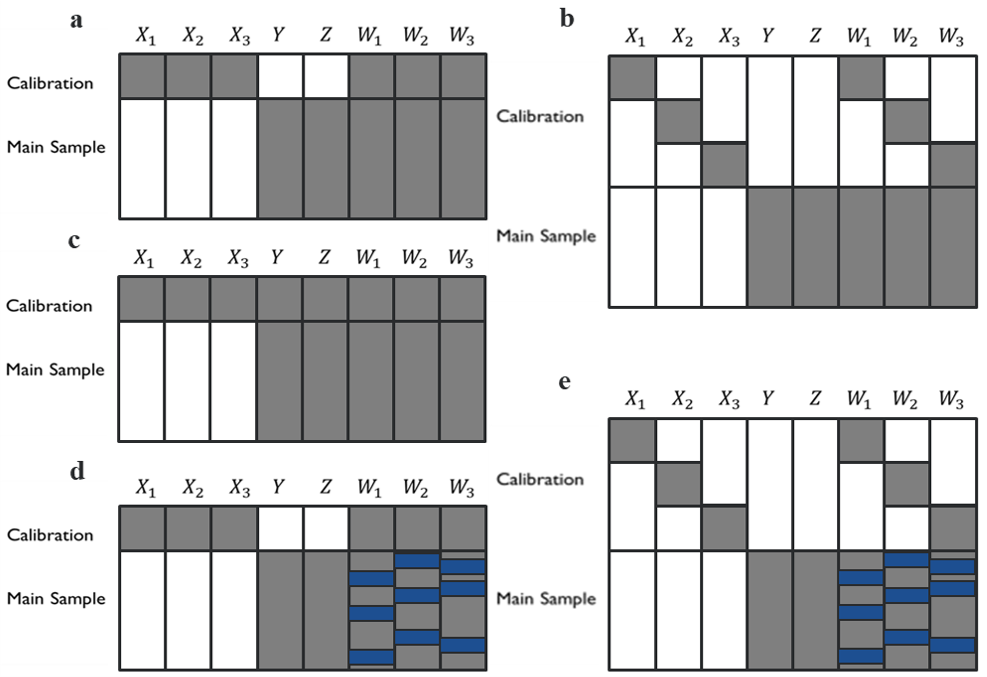
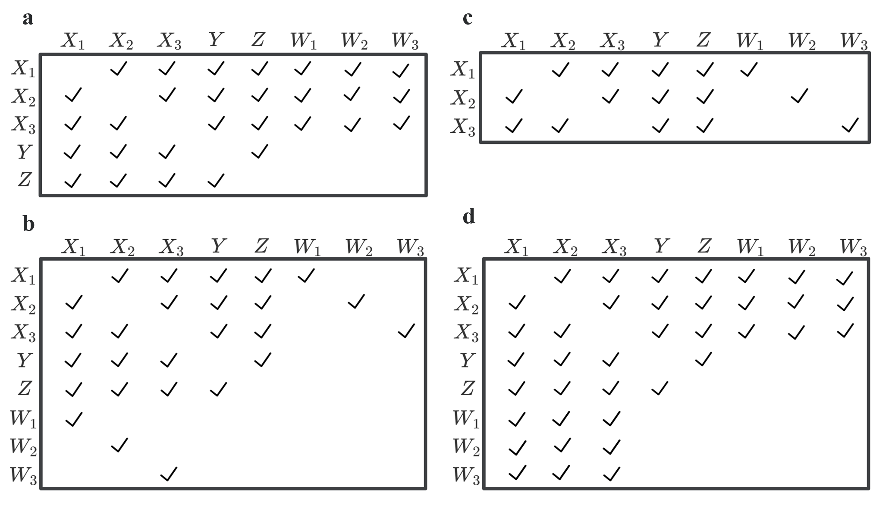

CCEMI
================

### Data structure (scenario a, b, c, d, e)



Three study designs using calibration data for correcting measurement
errors in the main study sample: (a) external design with common
calibration data for all X, (b) external design with different
calibration data for each X, (c) internal design, and (d), (e) external
design with common or different calibration data but some measures in W
in the main study sample are below limits of detection (LODs). The gray
areas denote observed data, the blanks denote missing data, and the blue
areas denote data below LODs.

### Imputation Matrix

Four imputation matrices, applying constraints of the strong NDME
assumptions, used in the constrained CEMI method for correcting
measurement errors in the main study sample: (a) external design with a
common calibration data for all $X$s, (b) external design with different
calibration data for each $X$, (c) internal design, and (d) external
design with a common calibration sample and some measures of
$\boldsymbol{W}$ in the main study data below LODs.



For different scenarios, we may use different Imputation matrixs, here
are two examples for scenario a and scenario e.

### Download CCEMI package from github

``` r
library(devtools)
devtools::install_github('yy3019/CCEMI', force = TRUE)
```

### CCEMI Example

#### Generate data for scenario a

``` r
data_generate1 = function(true_x1, true_x2, true_x3, true_z, rhoxx, rhoxz, sigmaww.x, rhoww.x){
  
  muxz <- c(0, 0, 0, 0) # Mean
  sigmaxz = matrix(c(1, 1*rhoxx, 1*rhoxx, 1*rhoxz, 
                     1*rhoxx, 1, 1*rhoxx, 1*rhoxz, 
                     1*rhoxx, 1*rhoxx, 1, 1*rhoxz, 
                     1*rhoxz, 1*rhoxz, 1*rhoxz, 1), 4, 4)
  
  sigmaxw <- matrix(c(sigmaww.x, sigmaww.x*rhoww.x, sigmaww.x*rhoww.x, 
                      sigmaww.x*rhoww.x,sigmaww.x, sigmaww.x*rhoww.x, 
                      sigmaww.x*rhoww.x, sigmaww.x*rhoww.x, sigmaww.x), 3, 3)
  df_xz_m = mvrnorm(n = 400, mu = muxz, Sigma = sigmaxz)
  
  #df_x = rbind(df_x_c, df_xz_m[,1:3])
  df_w = c()
  for(i in 1:400){
    muw = c((1.1* df_xz_m[i, 1]), (1.1 * df_xz_m[i, 2]), (1.1 * df_xz_m[i, 3]))
    df_w_a = mvrnorm(n = 1, mu = muw, Sigma = sigmaxw)
    df_w = rbind(df_w, df_w_a)
  }
  #zc = ifelse(df_xz_m[,4] >= 0, 1, 0) ## For binary data
  m_data = cbind(w1 = df_w[,1],
                       w2 = df_w[,2],
                       w3 = df_w[,3],
                       x1 = df_xz_m[,1],
                       x2 = df_xz_m[,2],
                       x3 = df_xz_m[,3],
                       z = df_xz_m[,4], 
                       y = rnorm(400, mean = true_x1 * df_xz_m[,1] + 
                                   true_x2 * df_xz_m[,2] + 
                                   true_x3 * df_xz_m[,3] + 
                                   true_z * df_xz_m[,4], 1)) %>% as.matrix()
  c_data = m_data
  

  m_data[c(101:400),4:6] = NA
  m_data[1:100,7:8] = NA
  
  return(list(m_data = m_data, c_data = c_data))
}

#### set missingness rate as 20%, 30%, 10% in W of main study sample
set.seed(666)
dg1 = data_generate1(1.2, 0.8, 0.4, 0.4, 0.3, 0.3, 0.25, 0)

#### External design with one calibration data
imp1 = dg1$m_data %>% as.tibble()
```

    ## Warning: `as.tibble()` was deprecated in tibble 2.0.0.
    ## ℹ Please use `as_tibble()` instead.
    ## ℹ The signature and semantics have changed, see `?as_tibble`.

``` r
#### Complete data ("True" data)
c_data1 = dg1$c_data %>% as.tibble()
```

#### Complete data (“True” data)

``` r
fit1_c = lm(y[101:400]~ x1[101:400] + x2[101:400] + x3[101:400] + z[101:400],data=c_data1)
cbind(fit1_c$coefficients,fit1_c %>% confint())
```

    ##                             2.5 %    97.5 %
    ## (Intercept) 0.06060663 -0.0503232 0.1715365
    ## x1[101:400] 1.26011570  1.1201435 1.4000879
    ## x2[101:400] 0.74163133  0.6263096 0.8569530
    ## x3[101:400] 0.50317793  0.3809808 0.6253750
    ## z[101:400]  0.35112224  0.2244285 0.4778160

#### For scenario a, we use CCEMI and Imputation Matrix a

``` r
library(CCEMI)
```

    ## 
    ## Attaching package: 'CCEMI'

    ## The following object is masked _by_ '.GlobalEnv':
    ## 
    ##     imp1

``` r
#### Set Imputation number (normally set as 2, default is 2)
bn = 2

#### Set PredMatrix
predM = rbind(c(0,0,0,0,0,0,0,0), # w1
              c(0,0,0,0,0,0,0,0), # w2
              c(0,0,0,0,0,0,0,0), # w3
              c(1,1,1,0,1,1,1,1), # x1
              c(1,1,1,1,0,1,1,1), # x2
              c(1,1,1,1,1,0,1,1), # x3
              c(0,0,0,1,1,1,0,1), # y
              c(0,0,0,1,1,1,1,0)) # z

#### Specify model
m1 = "y ~ x1 + x2 + x3 + z"

#### Set calibration & Main data row number
nCalib = 100
nMain = 300

set.seed(666)
t1 = CCEMI(data = imp1, predM = predM, nCalib = nCalib, nMain = nMain, model = m1, nImp = bn, nBoot = 200)

#### Imputed dataset (N = nImp * nBoot)
# t1$impst 

#### Complete Imputed dataset
# t1$imp_complete

#### Result summary
t1$result
```

    ## $ests
    ## [1] -0.07018129  1.36748420  0.71008333  0.42804262  0.36485574
    ## 
    ## $var
    ## [1] 0.008434466 0.013216339 0.011825148 0.010418662 0.005972463
    ## 
    ## $ci
    ##            [,1]      [,2]
    ## [1,] -0.2531220 0.1127594
    ## [2,]  1.1365748 1.5983936
    ## [3,]  0.4913242 0.9288424
    ## [4,]  0.2201074 0.6359778
    ## [5,]  0.2044491 0.5252624
    ## 
    ## $df
    ## [1] 75.31868 49.99335 47.03756 31.91522 21.68704

### CCEMI_LOD Example

#### Generate data for scenario e

``` r
data_generate2 = function(true_x1, true_x2, true_x3, true_z, rhoxx, rhoxz, sigmaww.x, rhoww.x, p1, p2, p3){
  
  muxz <- c(0, 0, 0, 0) # Mean
  sigmaxz = matrix(c(1, 1*rhoxx, 1*rhoxx, 1*rhoxz, 
                     1*rhoxx, 1, 1*rhoxx, 1*rhoxz, 
                     1*rhoxx, 1*rhoxx, 1, 1*rhoxz, 
                     1*rhoxz, 1*rhoxz, 1*rhoxz, 1), 4, 4)
  
  sigmaxw <- matrix(c(sigmaww.x, sigmaww.x*rhoww.x, sigmaww.x*rhoww.x, 
                      sigmaww.x*rhoww.x,sigmaww.x, sigmaww.x*rhoww.x, 
                      sigmaww.x*rhoww.x, sigmaww.x*rhoww.x, sigmaww.x), 3, 3)
  df_xz_m = mvrnorm(n = 600, mu = muxz, Sigma = sigmaxz)
  
  #df_x = rbind(df_x_c, df_xz_m[,1:3])
  df_w = c()
  for(i in 1:600){
    muw = c((1.1* df_xz_m[i, 1]), (1.1 * df_xz_m[i, 2]), (1.1 * df_xz_m[i, 3]))
    df_w_a = mvrnorm(n = 1, mu = muw, Sigma = sigmaxw)
    df_w = rbind(df_w, df_w_a)
  }
  #zc = ifelse(df_xz_m[,4] >= 0, 1, 0) ## For binary data
  missing_data = cbind(w1 = df_w[,1],
                       w2 = df_w[,2],
                       w3 = df_w[,3],
                       x1 = df_xz_m[,1],
                       x2 = df_xz_m[,2],
                       x3 = df_xz_m[,3],
                       z = df_xz_m[,4], 
                       y = rnorm(600, mean = true_x1 * df_xz_m[,1] + 
                                   true_x2 * df_xz_m[,2] + 
                                   true_x3 * df_xz_m[,3] + 
                                   true_z * df_xz_m[,4], 1)) %>% as.matrix()
  c_data = missing_data
  
  l_data = c_data
  l_data1 = l_data[1:300,]
  l_data2 = l_data[301:600,]
  m_data2 = l_data[301:600,]
  
  
  pp = c(l_data2[order(l_data2[,1],decreasing=F)[p1],1],
         l_data2[order(l_data2[,2],decreasing=F)[p2],2],
         l_data2[order(l_data2[,3],decreasing=F)[p3],3])
  nn = c(l_data2[order(l_data2[,1],decreasing=F)[1],1],
         l_data2[order(l_data2[,2],decreasing=F)[1],2],
         l_data2[order(l_data2[,3],decreasing=F)[1],3])
  
  
  m_data2[which(l_data2[,1]<=pp[1]),1]= log(exp(pp[1])/sqrt(2))
  m_data2[which(l_data2[,2]<=pp[2]),2]= log(exp(pp[1])/sqrt(2))
  m_data2[which(l_data2[,3]<=pp[3]),3]= log(exp(pp[1])/sqrt(2))
  
  l_data2[which(l_data2[,1]<=pp[1]),1]= NA
  l_data2[which(l_data2[,2]<=pp[2]),2]= NA
  l_data2[which(l_data2[,3]<=pp[3]),3]= NA
  
  
  l_data1[c(101:300), c(1, 4)] = NA
  l_data1[c(1:100, 201:300), c(2, 5)] = NA
  l_data1[c(1:201), c(3, 6)] = NA
  
  l_data = rbind(l_data1, l_data2)
  l_data[c(301:400),4:6] = NA
  l_data[1:300,7:8] = NA
  
  m_data = rbind(l_data1, m_data2)
  m_data[c(101:400),4:6] = NA
  m_data[1:100,7:8] = NA
  
  return(list(m_data = m_data, c_data = c_data, l_data = l_data, pp = pp, nn = nn))
}

#### set missingness rate as 20%, 30%, 10% in W of main study sample
set.seed(666)
dg = data_generate2(1.2, 0.8, 0.4, 0.4, 0.3, 0.3, 0.25, 0, 30, 30, 30)

#### Upper bound and lower bound of Ws
pp = dg$pp
nn = dg$nn


#### External design with different calibration data with lod
imp2_lod = dg$m_data %>% as.tibble()

#### External design with different calibration data with lod (make lod = NA for imputation)
imp2 = dg$l_data %>% as.tibble()

#### Complete data ("True" data)
c_data2 = dg$c_data %>% as.tibble()
```

#### Complete data (“True” data)

``` r
fit2_c = lm(y[301:600]~ x1[301:600] + x2[301:600] + x3[301:600] + z[301:600],data=c_data2)
cbind(fit2_c$coefficients,fit2_c %>% confint())
```

    ##                              2.5 %    97.5 %
    ## (Intercept) -0.04968077 -0.1668017 0.0674402
    ## x1[301:600]  1.20206546  1.0676338 1.3364971
    ## x2[301:600]  0.77784630  0.6331818 0.9225108
    ## x3[301:600]  0.37590524  0.2440186 0.5077919
    ## z[301:600]   0.38960258  0.2678533 0.5113518

#### For scenario e, we use CCEMI_LOD and Imputation Matrix b

``` r
#### Set "method" to specify the variable that we want to use tobit regression to impute
method1 = c("RUTR", "RUTR","RUTR","norm","norm","norm","norm","norm")

#### Set upper bound of LOD data
upper_bound = pp

#### Set Imputation Matrix

predM_lod = rbind(c(0,0,0,1,0,0,0,0), # w1
                  c(0,0,0,0,1,0,0,0), # w2
                  c(0,0,0,0,0,1,0,0), # w3
                  c(1,0,0,0,1,1,1,1), # x1
                  c(0,1,0,1,0,1,1,1), # x2
                  c(0,0,1,1,1,0,1,1), # x3
                  c(0,0,0,1,1,1,0,1), # y
                  c(0,0,0,1,1,1,1,0)) # z

#### Set nCalib and nMain

nCalib = 100
nMain = 300
#### Others keep the same

set.seed(666)
t2 = CCEMI_LOD(data = imp2, predM = predM_lod, nCalib = nCalib, nMain = nMain, model = m1, method = method1, upper_bound = upper_bound, nImp = bn, nBoot = 200)

t2$result
```

    ## $ests
    ## [1] -0.04405037  1.19799077  0.71610372  0.44095458  0.39462192
    ## 
    ## $var
    ## [1] 0.006141426 0.007125913 0.005983625 0.007319846 0.005471563
    ## 
    ## $ci
    ##            [,1]      [,2]
    ## [1,] -0.1989275 0.1108268
    ## [2,]  1.0303072 1.3656743
    ## [3,]  0.5621437 0.8700638
    ## [4,]  0.2712603 0.6106488
    ## [5,]  0.2480394 0.5412044
    ## 
    ## $df
    ## [1] 146.40853  90.86745  79.29959 102.29393 110.59142
