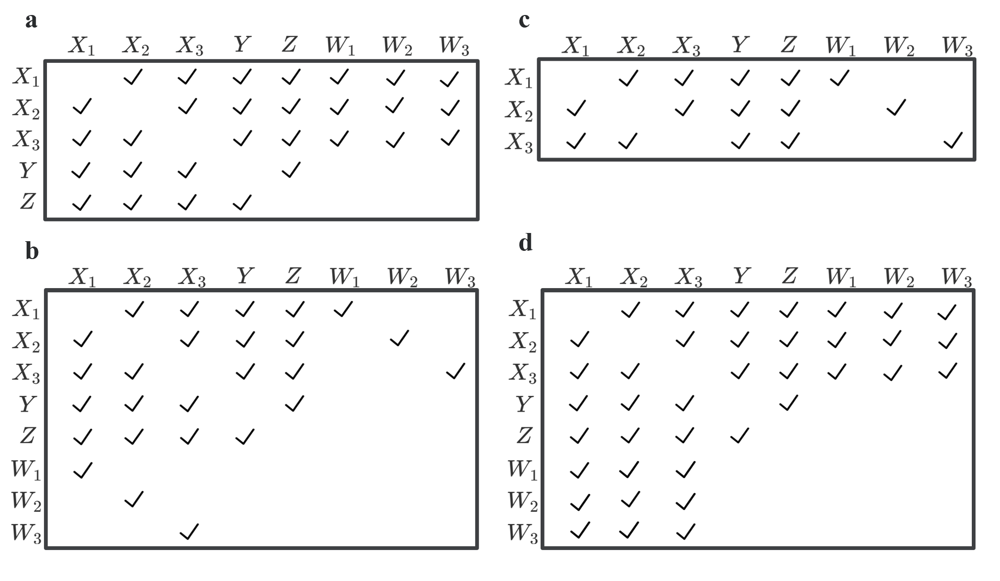

```{r setup, include=FALSE}
knitr::opts_chunk$set(echo = TRUE)
library(tidyverse)
library(bootImpute)
library(mice)
library(MASS)
library(AER)
library(MCMCglmm)
```

### Generate data

```{r}
data_generate = function(true_x1, true_x2, true_x3, true_z, rhoxx, rhoxz, sigmaww.x, rhoww.x, p1, p2, p3){
  
  muxz <- c(0, 0, 0, 0) # Mean
  sigmaxz = matrix(c(1, 1*rhoxx, 1*rhoxx, 1*rhoxz, 
                     1*rhoxx, 1, 1*rhoxx, 1*rhoxz, 
                     1*rhoxx, 1*rhoxx, 1, 1*rhoxz, 
                     1*rhoxz, 1*rhoxz, 1*rhoxz, 1), 4, 4)
  
  sigmaxw <- matrix(c(sigmaww.x, sigmaww.x*rhoww.x, sigmaww.x*rhoww.x, 
                      sigmaww.x*rhoww.x,sigmaww.x, sigmaww.x*rhoww.x, 
                      sigmaww.x*rhoww.x, sigmaww.x*rhoww.x, sigmaww.x), 3, 3)
  df_xz_m = mvrnorm(n = 400, mu = muxz, Sigma = sigmaxz)
  
  #df_x = rbind(df_x_c, df_xz_m[,1:3])
  df_w = c()
  for(i in 1:400){
    muw = c((1.1* df_xz_m[i, 1]), (1.1 * df_xz_m[i, 2]), (1.1 * df_xz_m[i, 3]))
    df_w_a = mvrnorm(n = 1, mu = muw, Sigma = sigmaxw)
    df_w = rbind(df_w, df_w_a)
  }
  #zc = ifelse(df_xz_m[,4] >= 0, 1, 0) ## For binary data
  missing_data = cbind(w1 = df_w[,1],
                       w2 = df_w[,2],
                       w3 = df_w[,3],
                       x1 = df_xz_m[,1],
                       x2 = df_xz_m[,2],
                       x3 = df_xz_m[,3],
                       z = df_xz_m[,4], 
                       y = rnorm(400, mean = true_x1 * df_xz_m[,1] + 
                                   true_x2 * df_xz_m[,2] + 
                                   true_x3 * df_xz_m[,3] + 
                                   true_z * df_xz_m[,4], 1)) %>% as.matrix()
  c_data = missing_data
  
  l_data = c_data
  l_data1 = l_data[1:100,]
  l_data2 = l_data[101:400,]
  m_data2 = l_data[101:400,]
  
  
  pp = c(l_data2[order(l_data2[,1],decreasing=F)[p1],1],
         l_data2[order(l_data2[,2],decreasing=F)[p2],2],
         l_data2[order(l_data2[,3],decreasing=F)[p3],3])
  nn = c(l_data2[order(l_data2[,1],decreasing=F)[1],1],
         l_data2[order(l_data2[,2],decreasing=F)[1],2],
         l_data2[order(l_data2[,3],decreasing=F)[1],3])
  
  
  m_data2[which(l_data2[,1]<=pp[1]),1]= log(exp(pp[1])/sqrt(2))
  m_data2[which(l_data2[,2]<=pp[2]),2]= log(exp(pp[1])/sqrt(2))
  m_data2[which(l_data2[,3]<=pp[3]),3]= log(exp(pp[1])/sqrt(2))
  
  l_data2[which(l_data2[,1]<=pp[1]),1]= NA
  l_data2[which(l_data2[,2]<=pp[2]),2]= NA
  l_data2[which(l_data2[,3]<=pp[3]),3]= NA
  
  l_data = rbind(l_data1, l_data2)
  l_data[c(101:400),4:6] = NA
  l_data[1:100,7:8] = NA
  
  m_data = rbind(l_data1, m_data2)
  m_data[c(101:400),4:6] = NA
  m_data[1:100,7:8] = NA
  
  return(list(m_data = m_data, c_data = c_data, l_data = l_data, pp = pp, nn = nn))
}

#### set missingness rate as 20%, 30%, 10% in W of main study sample
set.seed(666)
dg = data_generate(1.2, 0.8, 0.4, 0.4, 0.3, 0.3, 0.25, 0, 30, 30, 30)

#### Upper bound and lower bound of W
pp = dg$pp
nn = dg$nn

#### External design with one calibration data
imp1 = dg$m_data %>% as.tibble()

#### External design with one calibration data with lod
imp2 = dg$l_data %>% as.tibble()

#### Complete data ("True" data)
c_data = dg$c_data %>% as.tibble()

```

#### Data structure (scenario a, b, c, d, e)


Three study designs using calibration data for correcting measurement errors in the main
study sample: (a) external design with common calibration data for all X, (b) external design
with different calibration data for each X, (c) internal design, and (d), (e) external design with
common or different calibration data but some measures in W in the main study sample are below
limits of detection (LODs). The gray areas denote observed data, the blanks denote missing data,
and the blue areas denote data below LODs.


#### Complete data ("True" data) 

```{r}
fit_c = lm(y[101:400]~ x1[101:400] + x2[101:400] + x3[101:400] + z[101:400],data=c_data)
cbind(fit_c$coefficients,fit_c %>% confint())
```


### Download CICI package from github

```{r, echo=FALSE}
#library(devtools)
devtools::install_github('yy3019/CCEMI', force = TRUE)
```


### CICI Example 

#### Imputation Matrix

Four imputation matrices, applying constraints of the strong NDME assumptions, used in the constrained CEMI method for correcting measurement errors in the main study sample: (a) external design with a common calibration data for all $X$s, (b) external design with different calibration data for each $X$, (c) internal design, and (d) external design with a common calibration sample and some measures of $\boldsymbol{W}$ in the main study data below LODs.




#### For scenario a, we use CCEMI and Imputation Matrix a
```{r}
library(CCEMI)
#### Set Imputation number (normally set as 2, default is 2)
bn = 2

#### Set PredMatrix
predM = rbind(c(0,0,0,0,0,0,0,0), # w1
              c(0,0,0,0,0,0,0,0), # w2
              c(0,0,0,0,0,0,0,0), # w3
              c(1,1,1,0,1,1,1,1), # x1
              c(1,1,1,1,0,1,1,1), # x2
              c(1,1,1,1,1,0,1,1), # x3
              c(0,0,0,1,1,1,0,1), # y
              c(0,0,0,1,1,1,1,0)) # z

#### Specify model
m1 = "y ~ x1 + x2 + x3 + z"

#### Set calibration & Main data row number
nCalib = 100
nMain = 300


t1 = CCEMI(data = imp1, predM = predM, nCalib = nCalib, nMain = nMain, model = m1, nImp = bn, nBoot = 200)

#### Imputed dataset (N = nImp * nBoot)
# t1$impst 

#### Complete Imputed dataset
# t1$imp_complete

#### Result summary
t1$result
```

### CICI_LOD Example

```{r}
#### Set "method" to specify the variable that we want to use tobit regression to impute
method1 = c("RUTR", "RUTR","RUTR","norm","norm","norm","norm","norm")

#### Set upper bound of LOD data
upper_bound = pp

#### Others keep the same

t2 = CICI_LOD(data = imp2, predM = predM, nCalib = nCalib, nMain = nMain, model = m1, method = method1, upper_bound = upper_bound, nImp = bn, nBoot = 200)

t2$result
```


